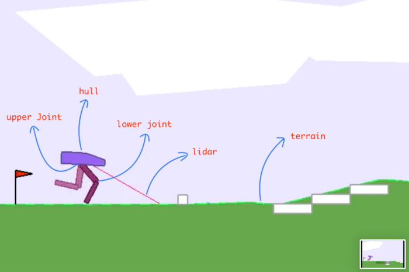

# Solving Lunar Lander and Bipedal Walker

## Reinforcement-Learning Final Project

In this work we applied the reinforcement-learning methods we learned in the course.
We demonstrate the use of a variety of learning methods in order to solve two RL known problems, the _Lunar Lander_ problem and the hardcore version of _Bipedal Walker_ problem.
The first problem will be solved, according to the requirements of the course, in its discrete version, while the second problem will be solved in the general and continuous version.

### Lunar Lander

### Bipedal Walker

